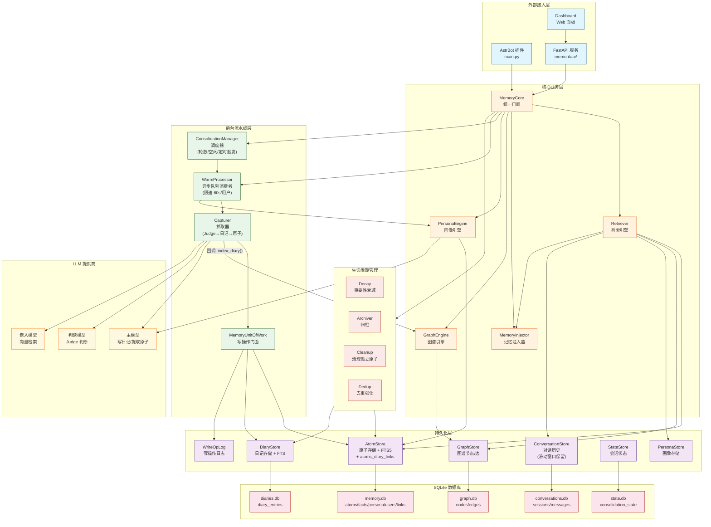
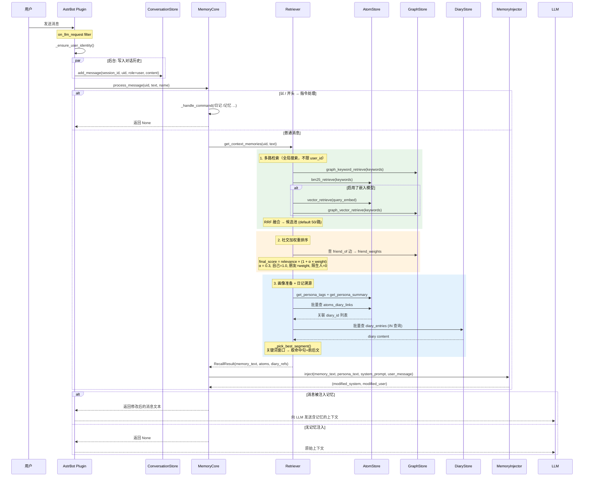
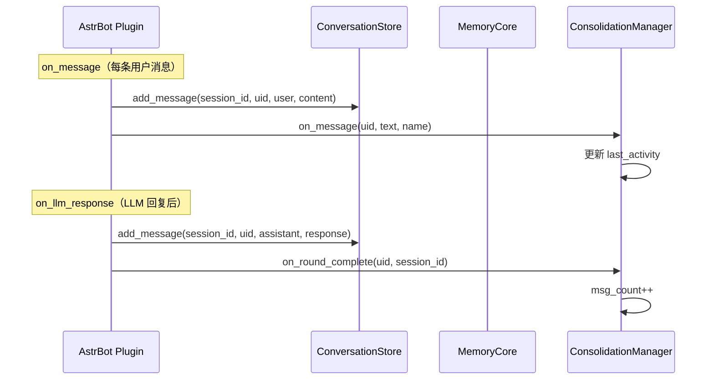
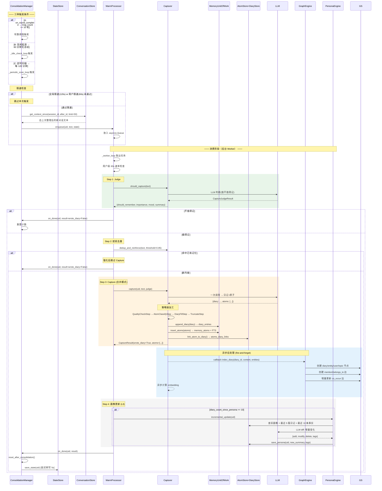
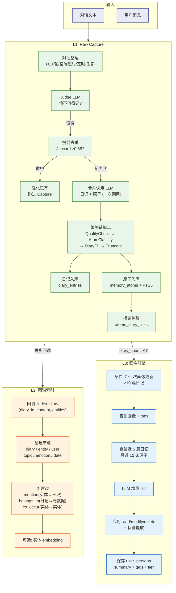
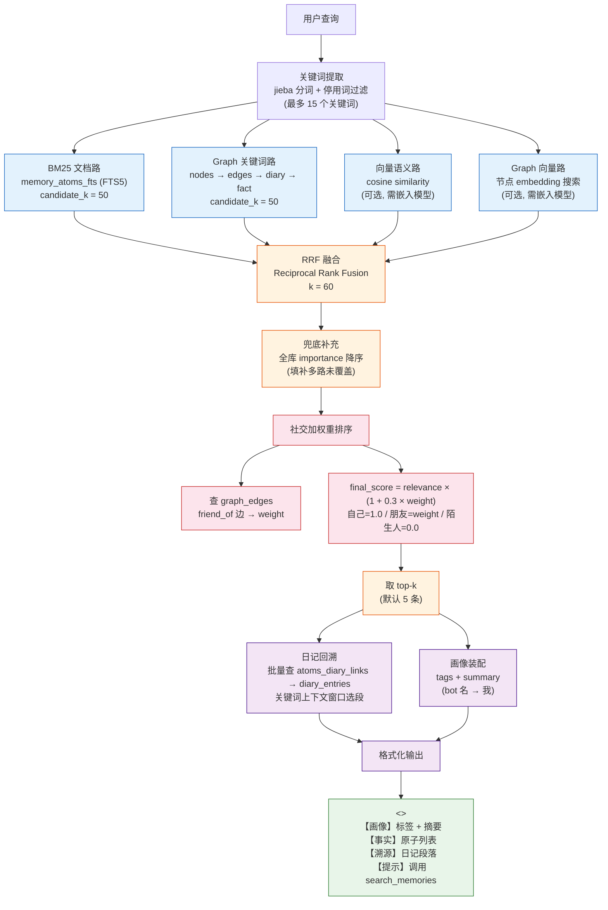

# memori 画像系统 — 架构与数据流

> 本文档基于 `memori/memori/` 运行时版本（无 HotMessageCache 版）

---

## 一、系统架构图



---

## 二、消息处理数据流（实时路径）



### 用户消息中的对话历史写入



---

## 三、后台整理流水线（异步路径）



---

## 四、三层画像流水线 (L1→L2→L3)



---

## 五、检索系统架构（双路四模式 + RRF 融合 + 社交加权重排序）



---

## 六、触发整理条件

```mermaid
flowchart LR
    subgraph Triggers["三种触发条件（任一满足）"]
        A["对话轮数阈值<br/>默认 10 轮<br/>(主触发)"]
        B["空闲超时<br/>默认 60 分钟<br/>(安全网)"]
        C["定时扫描<br/>默认 120 分钟<br/>(安全网)"]
    end

    Triggers --> OR{任一满足?}
    OR -->|是| RATE["限速检查"]

    subgraph RateLimit["限速 (全部通过才执行)"]
        D["去重间隔<br/>10s 内不重复检查"]
        E["用户级限速<br/>距上次 ≥ 60s"]
        F["全局限速<br/>距上次 ≥ 120s"]
    end

    RATE --> RateLimit
    RateLimit -->|通过| WP["WarmProcessor 入队列"]
    RateLimit -->|未通过| SKIP["跳过本次"]

    WP --> P["并发限速<br/>60s/用户<br/>(队列内)"]
    P --> WORK["Worker 消费<br/>Judge → Capture → Persona"]

    classDef trigger fill:#fce4ec,stroke:#c62828
    classDef rate fill:#fff8e1,stroke:#f57f17
    classDef flow fill:#e8f5e9,stroke:#2e7d32
    class A,B,C trigger
    class D,E,F,P rate
    class SKIP skip
```



---

## 七、数据表关系（核心模型）

```mermaid
erDiagram
    canonical_users ||--o{ user_identities : "一个用户有多个平台身份"
    canonical_users ||--o| user_persona : "一个用户有一个画像"
    canonical_users ||--o{ diary_entries : "一个用户有多篇日记"

    diary_entries ||--o{ atoms_diary_links : "一篇日记关联多个原子"
    memory_atoms ||--o{ atoms_diary_links : "一个原子被多篇日记引用"
    memory_atoms ||--o| memory_atoms_fts : "FTS5 索引"

    atomic_facts ||--o{ diary_fact_links : "一个事实被多篇日记引用"
    diary_entries ||--o{ diary_fact_links : "一篇日记有多个事实"

    %% graph.db
    nodes ||--o{ edges : "节点间有边"
    edges ||--o| diary_entries : "边可通过 diary_id 关联到日记"

    canonical_users {
        string uid PK "u_xxxx"
        string primary_name "显示名"
    }
    user_identities {
        string platform_id PK "qq:12345"
        string uid FK "关联 canonical_users"
        string platform "qq / telegram"
        string display_name "显示名"
    }
    user_persona {
        string uid PK
        string summary "一句话摘要"
        string full_markdown "完整画像"
        string tags '["技术","Python"]'
        string tier "new / active / core"
        int incremental_count "增量次数"
        int diary_count_since_full "距上次全量日记数"
    }
    diary_entries {
        int id PK
        string user_id
        string date "YYYY-MM-DD"
        string content "日记正文(frontmatter + body)"
        float importance
        string sentiment
        string topics
    }
    memory_atoms {
        int id PK
        string user_id
        string diary_date
        string atom_type "episodic / factual / preference / planned / relational"
        string content "<= 200 字"
        float importance
        float confidence
        string entities '["实体名"]'
        blob embedding "向量 JSON"
        string status "active / dormant / archived / forgotten"
        float ttl_days "TTL 天数"
        float expires_at "过期时间戳"
        string decay_type "exponential / linear / step"
    }
    memory_atoms_fts {
        int atom_id FK
        string content
        string user_id
    }
    atoms_diary_links {
        int atom_id FK
        int diary_id FK
        float importance
        string snippet "原文片段"
    }
    atomic_facts {
        int id PK
        string content UNIQUE "全局去重"
        int source_count "引用次数"
        float importance
    }
    diary_fact_links {
        int diary_id FK
        int fact_id FK
        float importance
        string snippet
    }
    nodes {
        string id PK "entity:hako / user:u_xxx / topic:coffee"
        string type "entity / user / topic / emotion / date / diary"
        string name
        blob embedding
    }
    edges {
        string id PK
        string from_node FK
        string to_node FK
        string relation_type "mention / co_occur / belongs_to / friend_of / blocked_by"
        int diary_id
        float weight
        string status "active / pending / passive / blocked / rejected"
    }
```

---

## 八、后台定时循环

| 循环 | 周期 | 职责 | 文件 |
|------|------|------|------|
| **对话滑动窗口清理** | 每 120s | 清理 `conversations.db` 过期的消息记录 | `memory_core.py:_cleanup_loop()` |
| **图谱共现统计** | 每 24h | 增量统计 co_occur 边权重 | `graph_engine.py:batch_cooccur()` |
| **重要性衰减** | 每 24h | importance × 0.99 (按原子类型不同半衰期) | `lifecycle/decay.py` |
| **归档** | 每 24h | 旧日记转 Markdown 文件输出 | `lifecycle/archiver.py` |
| **清理** | 每 24h | 删除孤立原子、过期 `forgotten` 原子 | `lifecycle/cleanup.py` |
| **会话状态刷写** | 每 5s | 延迟写入 `consolidation_state` | `consolidation_manager.py:_flush_loop()` |
| **空闲检测** | 每 60s | 扫描无活动用户，触发兜底整理 | `consolidation_manager.py:_idle_check_loop()` |
| **定时扫描** | 每 120 分钟 | 全量扫描积压用户 | `consolidation_manager.py:_periodic_scan_loop()` |

---

## 九、模块职责说明

| 模块 | 路径 | 职责 |
|------|------|------|
| **MemoryCore** | `core/memory_core.py` | 统一门面，初始化 8 阶段装配，对外暴露 `process_message()` |
| **MemoryInjector** | `core/memory_injector.py` | 控制注入位置(system_prompt/user_message/knowledge/manual)和模板 |
| **Retriever** | `core/retriever.py` | 双路四模式检索+RRF融合+社交加权重排序，批量日记溯源 |
| **GraphEngine** | `features/graph_engine.py` | Capturer 回调索引日记 → 节点/边，社交关系 claim/confirm/reject 管理 |
| **PersonaEngine** | `features/persona_engine.py` | 增量(LLM diff) / 全量(LLM rebuild) 画像更新，60s TTLCache |
| **ConsolidationManager** | `pipeline/consolidation_manager.py` | 三种触发 + 两级限速 + 5s延迟刷写状态 |
| **WarmProcessor** | `pipeline/warm_processor.py` | 异步队列消费者(3重试+退避)，提前去重→Capture→Persona |
| **Capturer** | `pipeline/capturer.py` | Judge+合并模式Capture+策略链+异步图谱索引+异步embedding |
| **CommandHandler** | `features/command_handler.py` | `/日记 /记忆 /记忆搜索 /记忆删除 /记忆统计 /记忆重构` |
| **MemoryUnitOfWork** | `pipeline/memory_uow.py` | Capturer的存储门面，封装 DiaryStore+AtomStore+WriteOpLog |

### 与旧版（已删除）的关键差异

| 特性 | 旧版 (`core/`) | 新版 (`memori/core/`) |
|------|---------------|----------------------|
| HotMessageCache | 有 (WAL + 60s刷写) | **已删除**，消息直接写 `conversation_store.add_message()` |
| 检索范围 | 按 user_id 过滤 | **全局检索 + 社交加权重排序** |
| 日记回溯 | 逐条查询 `_find_atom_diaries()` → `_best_diary_segment()` | **批量查询** `atoms_diary_links` → `IN(...)` 批量读 diary |
| 段落匹配 | Jaccard 相似度 | **关键词上下文窗口** (取命中句+前后句) |
| 社交排序 | 无 | **`_social_rerank()`** friend_of 边加权 |
| 嵌入模型初始化 | 从外部传入 | **`_init_embed_provider()`** 从配置动态创建 |
| 后台清理循环 | HotCache 刷写 | **`_cleanup_loop()`** 对话滑动窗口清理 |
| 后端任务 | `hotcache_flush` + `co_occur` + `lifecycle` | `cleanup`(120s) + `co_occur`(24h) + `lifecycle`(24h) |
| Embedding 支持 | 固定 | bge-m3 / Ollama / API 三种后端动态切换 |
